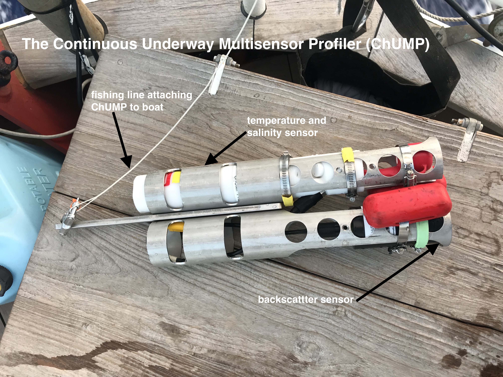

```{r setup, include=FALSE, echo = FALSE, warning = FALSE, error = FALSE, echo = FALSE, message = FALSE}

# This chunk for setup code - libraries and processing etc.

## leave this, this just helps with graphic representation
# knitr::opts_chunk$set(dev='png', dev.args = list(type = "cairo"), dpi = 150)

# include libraries you'll need here
# install.packages("~/Desktop/S285_0.0.1.tar.gz", repos = NULL)

library(tidyverse)
library(oce)
library(S285)
library(gridExtra)

#creating the initial dataframes---------------------------------------------------------------------
adcp <- S285$adcp
adcp$lon[adcp$lon < 0 & !is.na(adcp$lon)] <- adcp$lon[adcp$lon < 0 & !is.na(adcp$lon)] + 360

S285_data <- S285$hourly
S285_data$lon[S285_data$lon < 0] <- S285_data$lon[S285_data$lon < 0] + 360

chump <- S285$chump

df <- data_frame(chump[[1]]@metadata$longitude,
                 chump[[1]]@metadata$latitude,
                 chump[[1]]@data$scan,
                 chump[[1]]@data$temperature, 
                 chump[[1]]@data$salinity,
                 chump[[1]]@data$pressure, 
                 chump[[1]]@data$conductivity)

names(df) <- c("lon", "lat", "cast", "temp", "sal", "pressure", "conductivity")

for (i in 2:length(chump)) {
  df2 <- data_frame(chump[[i]]@metadata$longitude,
                    chump[[i]]@metadata$latitude,
                    chump[[i]]@data$scan,
                    chump[[i]]@data$temperature, 
                    chump[[i]]@data$salinity,
                    chump[[i]]@data$pressure, 
                    chump[[i]]@data$conductivity)
  names(df2) <- c("lon", "lat", "cast", "temp", "sal", "pressure", "conductivity")
  df <- bind_rows(df, df2)
}

chump <- df

#functions to get ADCP velocity components----------------------------------------------------------
find_angle <- function(lon1, lat1, lon2, lat2) {
  
  latav <- mean(c(lat1,lat2))
  
  dx <- oce::geodDist(lon1, latav, lon2, latav)
  dy <- oce::geodDist(lon1, lat1, lon1, lat2)
  
  dx <- sign(lon2-lon1)*dx
  dy <- sign(lat2-lat1)*dy
  
  angle <- atan2(dx,dy)*180/pi
  
  return(angle)
}

rot_ac <- function(u,v,angle) {
  angle_rad <- angle*pi/180
  along <- u * sin(angle_rad) + v * cos(angle_rad);
  cross <- u * cos(angle_rad) - v * sin(angle_rad);
  return(list(along,cross))
}

depth_avg <- function(adcp, depth = 100) {
  d_select <- depth
  di <- which.min(abs(adcp$d - d_select))
  
  uav <- rowMeans(adcp$u[,1:di], na.rm = T)
  vav <- rowMeans(adcp$v[,1:di], na.rm = T)
  
  df_avg <- tibble::tibble(dttm = adcp$dttm,
                           lon = ifelse(adcp$lon < 0, adcp$lon + 360, adcp$lon),
                           lat = adcp$lat,
                           u = uav,
                           v = vav)
  return(df_avg)
  
}

vel_mag <- function(u,v){
  mag = ((u**2) + (v**2))**0.5
  return(mag) 
}

#dataframes----------------------------------------------------------------------------------------- 
#ADCP velocity data 
top_100m <- depth_avg(adcp)
top_100m <- mutate(top_100m, mag = vel_mag(top_100m$u, top_100m$v))
top_100m$mag[top_100m$mag > 0.60] <- NA
top_100m$lon[top_100m$lon < 0 & !is.na(top_100m$lon)] <- top_100m$lon[top_100m$lon < 0 & !is.na(top_100m$lon)] + 360
top_100m$lon[top_100m$lon > 300] <- NA

#velocity differentials and gradients 
vlim <- 0.25

top_100m <- mutate(top_100m, mag_diff = c(NA, abs(diff(top_100m$mag))))
top_100m <- mutate(top_100m, mag_grad = c(NA, diff(top_100m$mag)))
top_100m <- mutate(top_100m, mag_mark = ifelse(top_100m$mag_diff > vlim, T, F))
top_100m <- mutate(top_100m, u_diff = c(NA, abs(diff(top_100m$u))))
top_100m <- mutate(top_100m, u_mark = ifelse(top_100m$u_diff > vlim, T, F))
top_100m <- mutate(top_100m, v_diff = c(NA, abs(diff(top_100m$v))))
top_100m <- mutate(top_100m, v_mark = ifelse(top_100m$v_diff > vlim, T, F))

#S285 hourly data
#temp differentials and gradients
slim <- 0.10
tlim <- 0.25

S285_data <- mutate(S285_data, temp_diff = c(NA, abs(diff(S285_data$temp))))
S285_data <- mutate(S285_data, Tmark = ifelse(S285_data$temp_diff > tlim, T, F))
S285_data <- mutate(S285_data, temp_grad = c(NA, diff(S285_data$temp)))
S285_data$temp_grad[S285_data$temp_grad < -1.0] <- NA

#salinity differentials and gradients 
S285_data <- mutate(S285_data, sal_diff = c(NA, abs(diff(S285_data$sal))))
S285_data <- mutate(S285_data, Smark = ifelse(S285_data$sal_diff > slim, T, F))
S285_data <- mutate(S285_data, sal_grad = c(NA, diff(S285_data$sal)))
S285_data$sal_grad[S285_data$sal_grad > 0.5] <- NA

#chump
chump$lon[!is.na(chump$lon) & chump$lon < 0] <- chump$lon[!is.na(chump$lon) & chump$lon < 0] + 360

#axis labels-------------------------------------------------------------------------------------
world <- map_data("world2")

latlab <- seq(-45,-15,5)
latlab_text <- paste(abs(latlab), "°S")

lonlab <- seq(170, 220, 10)
deglab <- ifelse(lonlab>180, "°W", "°E")

lonlab2 <- lonlab
lonlab2[lonlab2>180] <- abs(lonlab2[lonlab2>180] - 360)
lonlab_text <- paste(lonlab2, deglab)
```


### Summary 

```{r, echo = FALSE}
#Maps of ADCP data and cruise temperature gradients 

vel_map <- ggplot(world) +
  geom_polygon(aes(long, lat, group = group), fill = "darkgreen") +
  coord_quickmap(xlim = c(168, 215), ylim = c(-47, -16)) +
  geom_point(data = top_100m, aes(lon, lat, color = u), size = 1) +
  geom_point(data = filter(top_100m,u_mark==T), aes(lon, lat), pch = 1) +
  scale_y_continuous(breaks = latlab, labels = latlab_text) +
  scale_x_continuous(breaks = lonlab, labels = lonlab_text) +
  labs(x = NULL, y = NULL, color = "Velocity (m/s)",
       title = "East-West Current Velocities, Top 100m") +
  scale_color_gradient2(low = "blue", mid = "white", high = "red", lim = c(-0.4, 0.4)) +
  theme_bw() + 
  theme(panel.background = element_rect(fill = "lightcyan"), 
        panel.grid = element_line(color = "#bdbdbd", size = .1),
        panel.grid.minor = element_blank())

temp_grad_map <- ggplot(data = world) + 
  geom_polygon(data = world, aes(long,lat, group = group), fill = "darkgreen") +
  geom_path(data = S285_data, aes(lon, lat, color = temp), size = 1.5) +
  scale_color_gradientn(colors = oceColorsTemperature(10), 
                        limits = c(10,30)) +
  geom_point(data = filter(S285_data,Tmark==T),aes(lon, lat), pch = 1.2) +
  labs(x = NULL, y = NULL, color = "Temperature (°C)", 
       title = "Surface Temperature Changes") +
  coord_quickmap(xlim = c(168, 215), ylim = c(-47, -16)) +
  scale_y_continuous(breaks = latlab, labels = latlab_text) +
  scale_x_continuous(breaks = lonlab, labels = lonlab_text) +
  theme_bw() + 
  theme(panel.background = element_rect(fill = "lightcyan"), 
        panel.grid = element_line(color = "#bdbdbd", size = .1),
        panel.grid.minor = element_blank())

grid.arrange(temp_grad_map, vel_map)
```

***

**Baroclinic Instability & Mesoscale Currents**

An ocean front is a region in the ocean where the density changes sharply. These regions are often characterized by baroclinic instability, in which the pressure and density gradients of the water become misaligned. This can result in the creation of eddy flows, zonal jets, or vertical currents. The goal of this study is to investigate the relationship between temperature and salinity gradients and co-located changes in current velocity. These mesocale current features can influence other important oceanic factors like the mixed layer depth, nutrient cycling, carbon sequestration, and thermoregulation. These may impact the biology of the region, as well as local climate. Though the most drastic changes in temperature and salinity occurred in the temperate waters surrounding New Zealand, there were significantly more variations in surface gradients in the subtropical gyre than expected, which may suggest presence of microfronts or meanders. Sharp changes in temperature and salinity tended to be co-located with corresponding velocity changes, though the relationship between temperature and velocity magnitude was more profound, particularly in the subtropical gyre. 

### Methods: A combination of ChUMP, Flowthrough, and ADCP data 



```{r}
# Image/figure for methods section
#picture of ChUMP 
```
***

**ChUMP: Temperature and Salinity Gradients with Depth**
The Continuous Underway Multisensor Profiler (ChUMP) is a high resolution conductivity temperature depth (CTD) device used to collect temperature, salinity, and pressure data for casts of approximately 100 meters.  The benefit of using the ChUMP over the much larger hydrowinch-powered CTD is that it can be deployed off the stern while the boat is moving, allowing for more deployments and adaptive sampling techniques. Sampling frequency along our cruise track varied from every four hours (weather permitting) to intensive events in which the ChUMP was deployed every hour up to 30 hours in a row. These higher intensity bursts were chosen when flowthrough data indicated sharper changes in temperature and salinity. The flexibility and higher sampling frequency with ChUMP allowed us to observe mesoscale variations in the mixed layer depth and surface properties, which can be indicative of fronts.  

**The Flowthrough System: Surface Properties** 
The flowthrough system records temperature, salinity, and chlorophyll-a fluorescence data for the surface waters along the cruise track second by second, with the hourly values used to compare the rates of change of surface properties. These gradients were used to locate regions of rapid change for adaptive ChUMP sampling, and were compared to changes in velocity within the top 100 meters. 

**ADCP: Current Velocities**
The Acoustic Doppler Current Profiler (ADCP) is a sonar device located on the hull of the ship that continuously collects current speed and direction data using sound wave reflection. Five minute averages were used to calculate velocity magnitudes and  North-South and East-West components. In conjunction with the ChUMP and flowthorugh data, we used the current velocity data to confirm the location of potential fronts along cruise track.  

### Results 1: ChUMP Cross-Sections from Intensive Sampling 

```{r}

#need to fix these labels 
chumplonlab <- seq(160, 220, 2)
chumpdeglab <- ifelse(chumplonlab>180, "°W", "°E")

chumplonlab2 <- chumplonlab
chumplonlab2[chumplonlab2>180] <- abs(chumplonlab2[chumplonlab2>180] - 360)
chumplonlab_text <- paste(chumplonlab2, chumpdeglab)

chump_section1 <- ggplot(chump) +
  geom_path(aes(lon, -pressure, group = lon, color = temp), size = 3) +
  coord_cartesian(xlim= c(198, 209), ylim = c(0, -100)) +
  scale_x_continuous(breaks = chumplonlab, labels = chumplonlab_text) +
  scale_color_gradientn(colors = oceColorsTemperature(10)) +
  labs(x = NULL, y = "Pressure", color = "Temperature (°C)") +
  theme_bw()

velocity_graph1 <- ggplot(data = top_100m, aes(lon, mag)) +
  geom_path(data = top_100m, aes(lon, mag)) +
  coord_cartesian(xlim= c(198, 209)) +
  scale_x_continuous(breaks = chumplonlab, labels = chumplonlab_text) +
  labs(x = NULL, y = "velocity magnitude (m/s)") +
  theme_bw()

grid.arrange(chump_section1, velocity_graph1)

```

***
This figure shows a cross section of temperature with pressure (which can be interpreted as depth), interpolated from 19 actual ChUMP casts from (blank to blank degrees long (once labels fixed)), along with the corresponding velocity magnitudes. Areas in which the mixed layer depth appears to be shifting over relatively short spatial scales, as indicated by temperature and salinity gradients, and are associated with larger changes in velocity magnitudes within the top 100 meters. This supports the hypothesis that regions with higher baroclinic instability yield stronger currents. 


### Results 2: ADCP Velocity & Flowthrough Gradients 

```{r}
#velocity magnitudes through time for zoomed in portions of ChUMP data 
#gradients and differentials 
#then select temperature and salinity gradients/differentials for same areas 
#grid 

#temp
S285_temp_grad_graph <- ggplot(data = S285_data, aes(dttm, temp_grad)) +
  geom_path(data = S285_data, aes(dttm, temp_grad, color = temp))+
  scale_color_gradientn(colors = oceColorsTemperature(10))+
  labs(x = NULL, y = "Temperature Gradient (°C/hr)", color = "Temperature (°C)",
       title = "Gradients Through Time") +
  theme_bw()

#salinity
S285_sal_grad_graph <- ggplot(data = S285_data, aes(dttm, sal_grad)) +
  geom_path(data = S285_data, aes(dttm, sal_grad, color = sal))+
  scale_color_gradientn(colors = oceColorsSalinity(5)) +
  labs(x = NULL, y = "Salinity Gradient (psu/hr)", color = "Salinity (psu)",
       title = NULL) +
  theme_bw()

#velocity 
top_100m_vel_graph <- ggplot(data = top_100m, aes(dttm, mag)) +
  geom_path(data = top_100m, aes(dttm, mag))+
  scale_color_gradient2(low = "blue", mid = "white", high = "red", lim = c(-0.4, 0.4)) +
  labs(x = NULL, y = "Velocity Magnitude Gradient (m/s/hr)", title = NULL) +
  theme_bw()

grid.arrange(S285_temp_grad_graph, S285_sal_grad_graph, top_100m_vel_graph) 

```

***

Temperature and salinity differentials measure the gradients of temperature and salinity over the cruise track. A higher gradient indicates a higher change in either parameter over a given period of time.  Regions where the temperature and salinity gradients line up with the magnitude of the current velocity can indicate regions of potential fronts and meanders, and this pattern is seen via co-location of the three variables. This time series shows that spikes in temperature and salinity gradients are associated with corresponding changes in velocity magnitude. 

(Choose section, interpret)


### Results 3: Maps of Current Velcocities and Surface Properties 

```{r, echo = FALSE}
#temp 
temp_grad_map <- ggplot(data = world) + 
  geom_polygon(data = world, aes(long,lat, group = group), fill = "darkgreen") +
  geom_path(data = S285_data, aes(lon, lat, color = temp), size = 1.5) +
  scale_color_gradientn(colors = oceColorsTemperature(10), 
                        limits = c(10,30)) +
  geom_point(data = filter(S285_data,Tmark==T),aes(lon, lat), pch = 1.2) +
  labs(x = NULL, y = NULL, color = "Temperature (°C)", 
       title = "Surface Temperature Changes") +
  coord_quickmap(xlim = c(168, 215), ylim = c(-47, -16)) +
  scale_y_continuous(breaks = latlab, labels = latlab_text) +
  scale_x_continuous(breaks = lonlab, labels = lonlab_text) +
  theme_bw() + 
  theme(panel.background = element_rect(fill = "lightcyan"), 
        panel.grid = element_line(color = "#bdbdbd", size = .1),
        panel.grid.minor = element_blank())

#salinity 
sal_grad_map <- ggplot(data = world) + 
  geom_polygon(data = world, aes(long,lat, group = group), fill = "darkgreen") +
  geom_path(data = S285_data, aes(lon, lat, color = sal), size = 1.5) +
  scale_color_gradientn(colors = oceColorsSalinity(10)) +
  geom_point(data = filter(S285_data,Smark==T),aes(lon, lat), pch = 1) +
  labs(title = "Surface Salinity Changes", x = NULL, y = NULL, color = "Salinity (psu)") +
  coord_quickmap(xlim = c(168, 215), ylim = c(-47, -16)) + 
  scale_y_continuous(breaks = latlab, labels = latlab_text) +
  scale_x_continuous(breaks = lonlab, labels = lonlab_text) +
  theme_bw() + 
  theme(panel.background = element_rect(fill = "lightcyan"), 
        panel.grid = element_line(color = "#bdbdbd", size = .1),
        panel.grid.minor = element_blank())

#NS velocity (v)
v_grad_map <- ggplot(world) +
  geom_polygon(aes(long, lat, group = group), fill = "darkgreen") +
  geom_point(data = top_100m, aes(lon, lat, color = v), size = 1) +
  scale_color_gradient2(low = "blue", mid = "white", high = "red", lim = c(-0.4, 0.4)) +
  geom_point(data = filter(top_100m,v_mark==T), aes(lon, lat), pch = 1) +
  labs(x = NULL, y = NULL, color = "Velocity (m/s)",
       title = "North-South Current Velocities") +
  coord_quickmap(xlim = c(168, 215), ylim = c(-47, -16)) +
  scale_y_continuous(breaks = latlab, labels = latlab_text) +
  scale_x_continuous(breaks = lonlab, labels = lonlab_text) +
  theme_bw() + 
  theme(panel.background = element_rect(fill = "lightcyan"), 
        panel.grid = element_line(color = "#bdbdbd", size = .1),
        panel.grid.minor = element_blank())

#EW velocity (u)
u_grad_map <- ggplot(world) +
  geom_polygon(aes(long, lat, group = group), fill = "darkgreen") +
  geom_point(data = top_100m, aes(lon, lat, color = u), size = 1) +
  scale_color_gradient2(low = "blue", mid = "white", high = "red", lim = c(-0.4, 0.4)) +
  geom_point(data = filter(top_100m, u_mark==T), aes(lon, lat), pch = 1) +
  labs(x = NULL, y = NULL, color = "Velocity (m/s)",
       title = "East-West Current Velocities") +
  coord_quickmap(xlim = c(168, 215), ylim = c(-47, -16)) +
  scale_y_continuous(breaks = latlab, labels = latlab_text) +
  scale_x_continuous(breaks = lonlab, labels = lonlab_text) +
  theme_bw() + 
  theme(panel.background = element_rect(fill = "lightcyan"), 
        panel.grid = element_line(color = "#bdbdbd", size = .1),
        panel.grid.minor = element_blank())

grid.arrange(temp_grad_map, sal_grad_map, v_grad_map, u_grad_map)

#need a way to grid these (grid.arrange fucks the formatting up)
#could bust out multiplot ?
##use top 10% for finding the limits for things? Rn is pretty arbitrary

```

***
These maps show the changes in surface temperature and salinity and top 100 meter velocities for our cruise track. The underlying colors show the values of each variable, while black circles denote regions with sharper gradients. The criteria are as follows: changes of > 0.25 C/hour for temperature, > 0.10 psu/hour for salinity, and > 0.25 m/s for velocity. It can be seen that regions with sharper temperature and salinity gradients correspond to regions with larger changes in velocity (both North-South
and East-West); however, these seem to on the whole correspond better with temperature than salinity, 
particularly in the subtropical gyre where salinity changes were minimal. Future research should focus on depth gradient and velocity comparisons, as the ADCP data is averaged over the top 100 meters while the gradients are calculated from surface properties only. 

